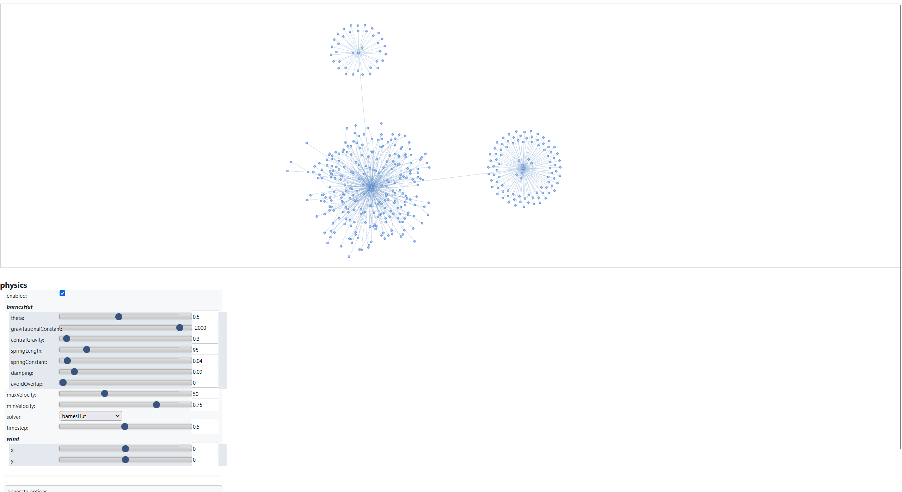
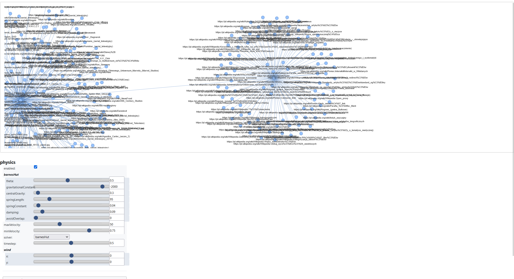
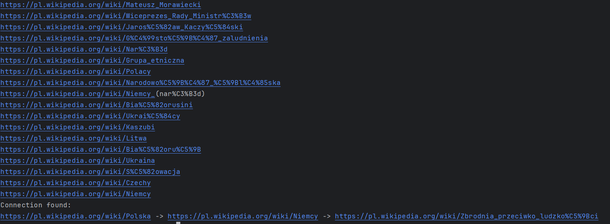

[![Contributors][contributors-shield]][contributors-url]
[![Forks][forks-shield]][forks-url]
[![Stargazers][stars-shield]][stars-url]
[![Issues][issues-shield]][issues-url]
[![MIT License][license-shield]][license-url]
[![LinkedIn][linkedin-shield]][linkedin-url]


<br />
<div align="center">

  <h2 align="center">Wikipedia Graph</h3>

  <p align="center">
    Crawl wikipedia and search for connection between 2 articles 
  </p>

  <a href="https://github.com/DEENUU1/">

  </a>
</div>

## Crawler



## Path finder 



<!-- ABOUT THE PROJECT -->
## About The Project
This project has 2 modules:
1. `crawler.py` allows to crawl all links from the given page, add them to graph and then visit all scraped urls.
After crawling is finished you can see generated graph by opening the html file.
2. `main.py` allows to search a connection between 2 urls - START_URL and END_URL the program works as long as the connection is not found.

## Built With

- Python
- Networkx
- pyvis
- requests
- bs4 

## Installation

### Development 
1. Clone git repository
```bash
git clone https://github.com/DEENUU1/wikipedia-graph.git
```

2. Install all requirements
```bash
pip install -r requirements.txt
```

3. Run selected script 
```bash
python crawler.py

python main.py
```

<!-- LICENSE -->
## License

See `LICENSE.txt` for more information.


<!-- MARKDOWN LINKS & IMAGES -->
<!-- https://www.markdownguide.org/basic-syntax/#reference-style-links -->
[contributors-shield]: https://img.shields.io/github/contributors/DEENUU1/wikipedia-graph.svg?style=for-the-badge
[contributors-url]: https://github.com/DEENUU1/wikipedia-graph/graphs/contributors
[forks-shield]: https://img.shields.io/github/forks/DEENUU1/wikipedia-graph.svg?style=for-the-badge
[forks-url]: https://github.com/DEENUU1/wikipedia-graph/network/members
[stars-shield]: https://img.shields.io/github/stars/DEENUU1/wikipedia-graph.svg?style=for-the-badge
[stars-url]: https://github.com/DEENUU1/wikipedia-graph/stargazers
[issues-shield]: https://img.shields.io/github/issues/DEENUU1/wikipedia-graph.svg?style=for-the-badge
[issues-url]: https://github.com/DEENUU1/wikipedia-graph/issues
[license-shield]: https://img.shields.io/github/license/DEENUU1/wikipedia-graph.svg?style=for-the-badge
[license-url]: https://github.com/DEENUU1/wikipedia-graph/blob/master/LICENSE.txt
[linkedin-shield]: https://img.shields.io/badge/-LinkedIn-black.svg?style=for-the-badge&logo=linkedin&colorB=555
[linkedin-url]: https://linkedin.com/in/kacper-wlodarczyk
